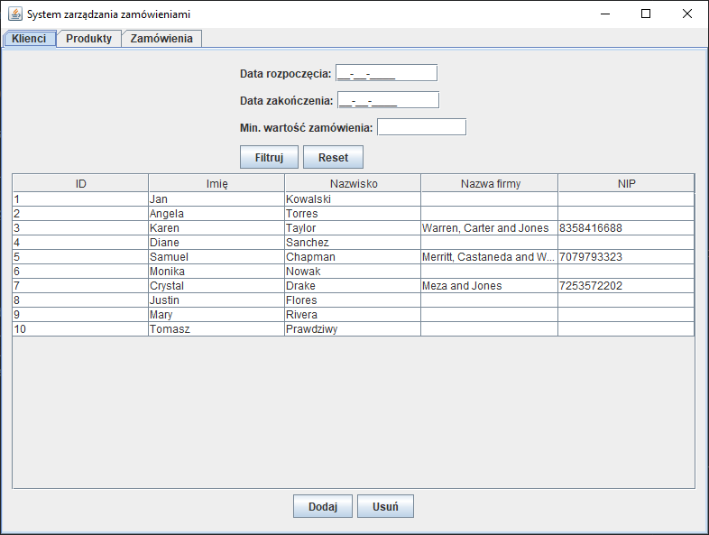
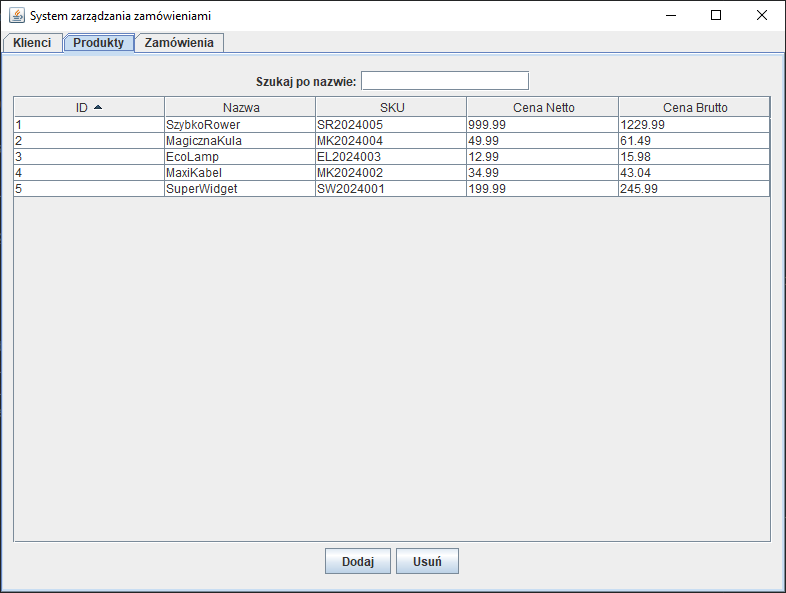
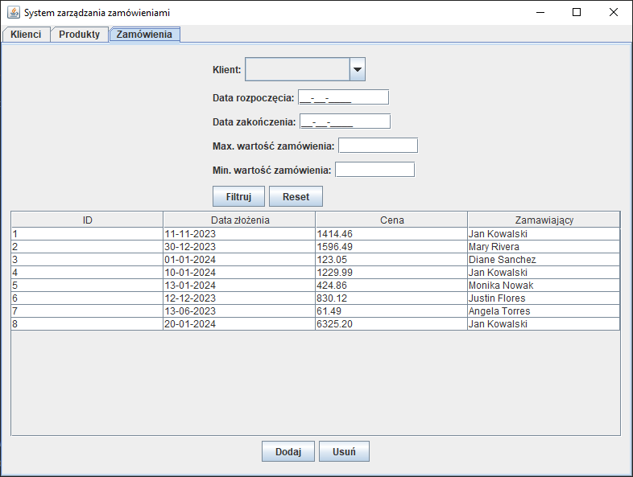
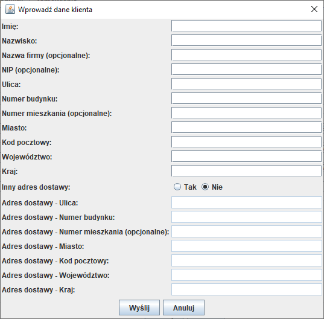
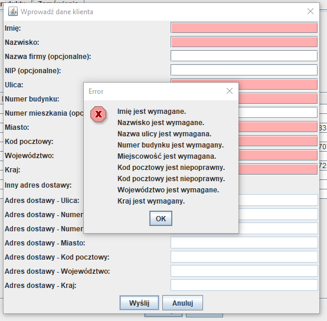
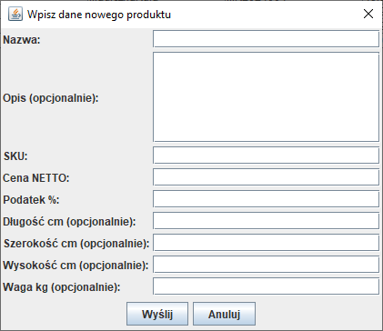
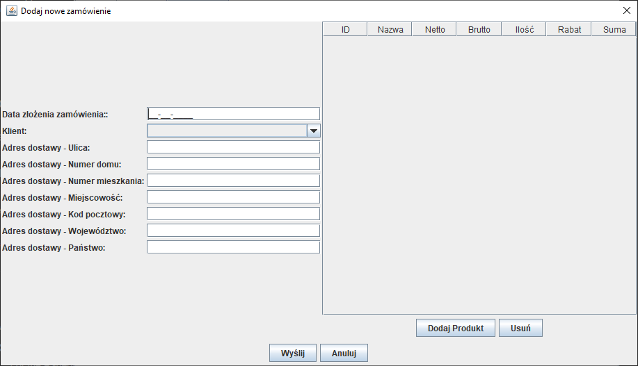
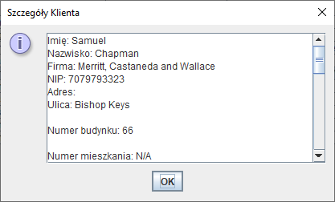
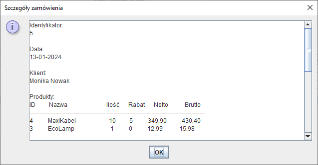
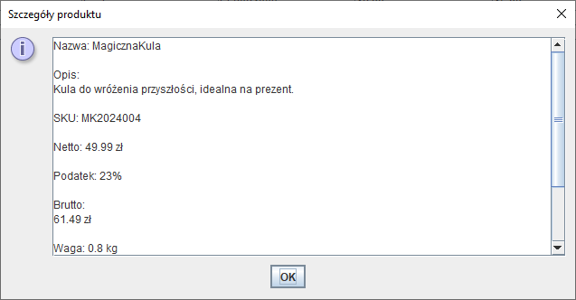

# Order Management System

This is a Java-based desktop application designed to manage orders in a store. The application provides functionality for managing customers, products, and orders through a graphical user interface (GUI) developed using the Swing framework. The application is structured around the MVC (Model-View-Controller) design pattern and is built with a focus on extensibility and maintainability.

## Table of Contents

- [Features](#features)
- [Technologies](#technologies)
- [Database Design and Structure](#database-design-and-structure)
- [Design Patterns](#design-patterns)
- [Installation](#installation)
- [Screenshots](#screenshots)
- [License](#license)

## Features

The application offers the following features:

1. **Customer Management**:
    - Add new customers with details such as name, address, and optional company information.
    - View and filter customers by various criteria, including order date and total order value.
    - Edit and delete existing customer records.

2. **Product Management**:
    - Add new products with attributes like SKU, price, and optional dimensions.
    - Search products by name and view product details.
    - Edit and delete existing product records.

3. **Order Management**:
    - Create new orders by selecting customers and adding products with quantities and discounts.
    - View and filter orders by date, customer, and total value.
    - Edit and delete existing orders.

4. **Data Persistence**:
    - Customer, product, and order data are saved to files (`customers.dat`, `products.dat`, `orders.dat`), allowing persistence across application sessions.

5. **Graphical User Interface**:
    - User-friendly GUI built using Java Swing.
    - Form-based input for adding and editing customers, products, and orders.
    - Table-based views for browsing and filtering data.

## Technologies

- **Java**: Core programming language used for application logic.
- **Swing**: Java's GUI toolkit used for creating the graphical user interface.
- **MVC Pattern**: The application is structured using the Model-View-Controller design pattern to separate concerns and promote modularity.
- **Serialization**: Data is persisted using Java's object serialization to save and load data from files.

## Database Design and Structure

The application does not use a traditional database but instead stores data in serialized files. The structure is as follows:

- **customers.dat**: Stores serialized `Customer` objects.
- **products.dat**: Stores serialized `Product` objects.
- **orders.dat**: Stores serialized `Order` objects.

Each data file is managed by a corresponding controller that handles loading, saving, and manipulating the data.

## Design Patterns

The application implements several design patterns:

1. **MVC (Model-View-Controller)**:
    - **Model**: Contains the business logic and data structures (e.g., `Customer`, `Product`, `Order`).
    - **View**: The GUI components that display data to the user and receive user input.
    - **Controller**: Manages the interaction between the Model and View (e.g., `CustomerController`, `ProductController`, `OrderController`).

2. **Singleton**:
    - Not explicitly used, but could be applied to controllers or utility classes if global access to instances is required.

3. **Observer**:
    - Implicitly used via listeners in Swing components to handle events like button clicks and text field changes.

## Installation

To install and run the application:

1. **Prerequisites**:
    - Ensure you have JDK 8 or higher installed on your machine.

2. **Clone the Repository**:
   ```bash
   git clone https://github.com/yourusername/order-management-system.git
   cd order-management-system
3. **Compile the Source Code**:
    ```bash
    javac -d bin $(find . -name "*.java")
4. **Run the Application**:
    ```
   java -cp bin Main

## Screenshots
Below are screenshots of the application showcasing various features.













## License
This project is licensed under the [MIT License](LICENSE.md) - see the file for details.

